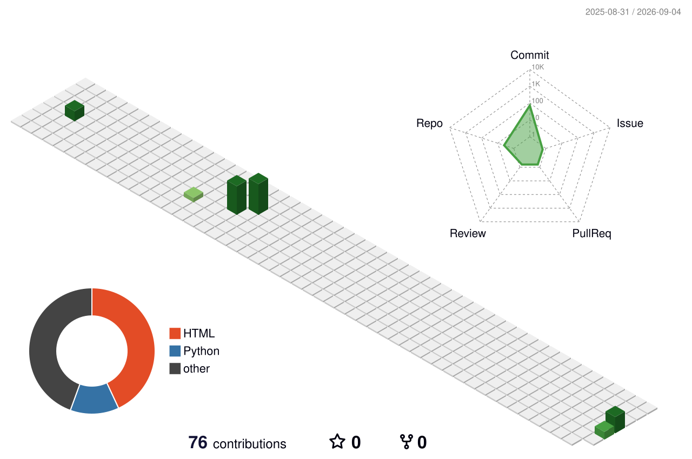

<h1 align="center">Hi 👋, I'm Karunya V</h1>

<h3 align="center">M.Sc. Data Science Student | B.Sc. Computer Science Graduate | Aspiring Data Scientist & Developer</h3>

  

  
  
  

---

## 👩‍💻 About Me

- 🎓 B.Sc. Computer Science Graduate
- 💻 Interested in Software Development, AI and Web Development
- 🌱 Currently improving my technical and development skills
- 🔍 Interested in building practical projects that solve real-world problems
- 🚀 Always learning and exploring new technologies

---

## 🛠️ Tech Stack

  

---

## 🚀 Featured Projects

### 🌱 NourishConnect – Donation Application

A donation-focused application designed to connect people who want to donate with those who need support.

**Focus:** Application Development • Social Impact • User Connectivity

---

### 🥭 Mango Leaf Disease Detection

A project that analyzes an uploaded mango leaf image to identify possible diseases and provides useful recommendations such as fertilizer requirements and watering guidance.

**Focus:** AI • Image Analysis • Agriculture

---

## 📊 GitHub Stats

  
  

---

## 🔥 GitHub Streak

  

---

## 📈 GitHub Contributions

  

---

## 🧊 3D Contribution Graph

  

---

## 👀 Profile Visitors

  

---

  ⭐ Thanks for visiting my profile! ⭐

